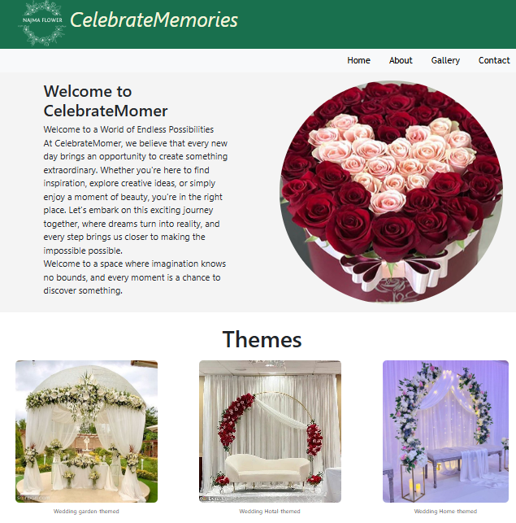

# 🎉 Celebrate Memories



**Celebrate Memories** is a responsive React website designed for event decoration services, including weddings, birthdays, and other special celebrations.

## ✨ Features

* 🎊 Wedding decoration showcase
* 🎂 Birthday decoration showcase
* 📸 Image gallery for event designs
* 📱 Responsive design
* 🧭 Page navigation
* 🎨 User-friendly interface

## 🛠️ Technologies

* **React 19**
* **JavaScript**
* **HTML5**
* **CSS3**
* **Bootstrap 5**
* **React Bootstrap**
* **React Router**

## 🚀 Getting Started

To run this project locally:

```bash
npm install
npm start
```

The application will open in your browser at:

```text
http://localhost:3000
```

## 📌 Project Type

**Frontend Web Application**

This project was built as a personal React project to practice frontend development and create a real-world event decoration website.

## 👩‍💻 Author

**Najma Rajabi**

GitHub: https://github.com/najma963
